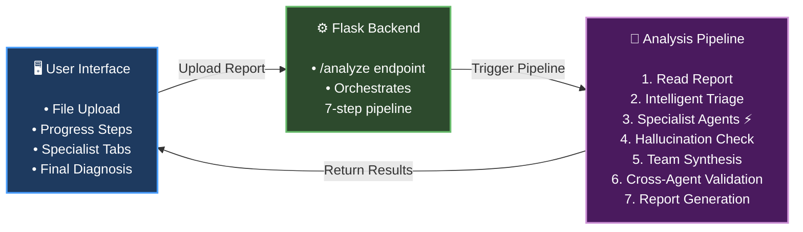
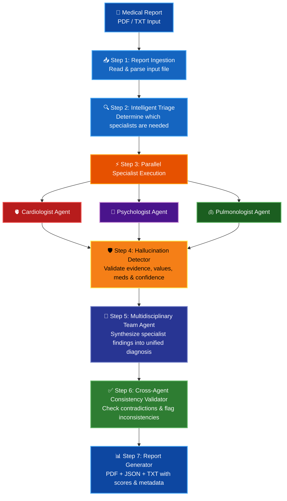
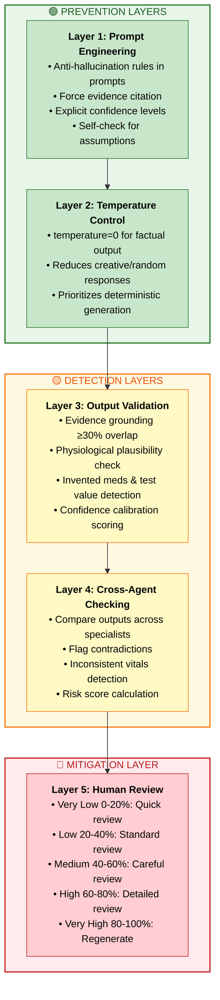
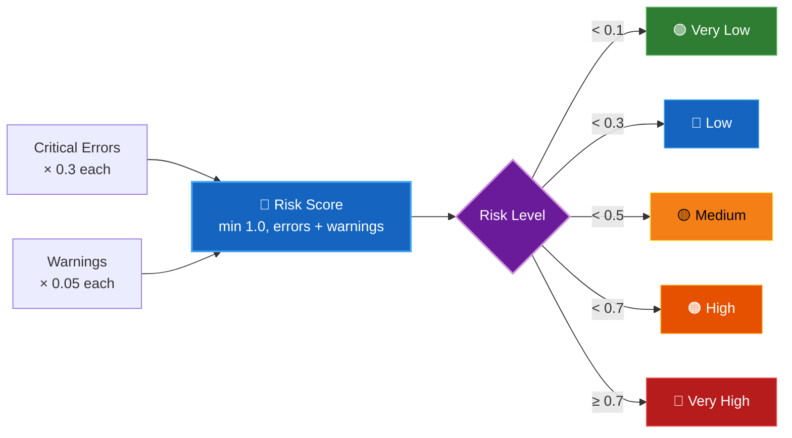
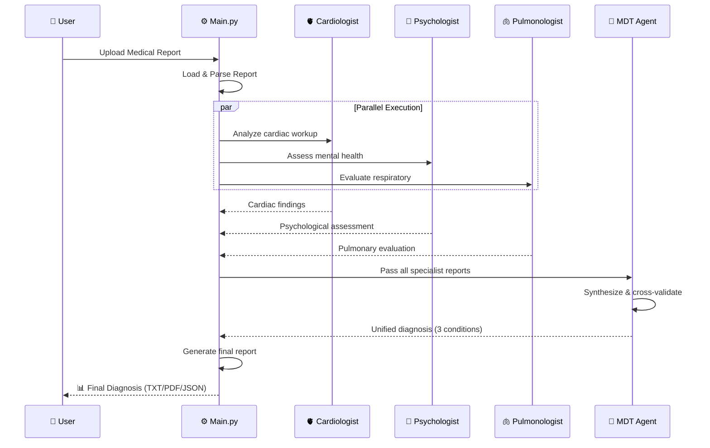
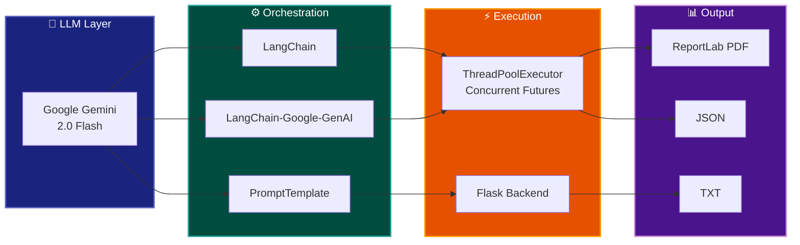
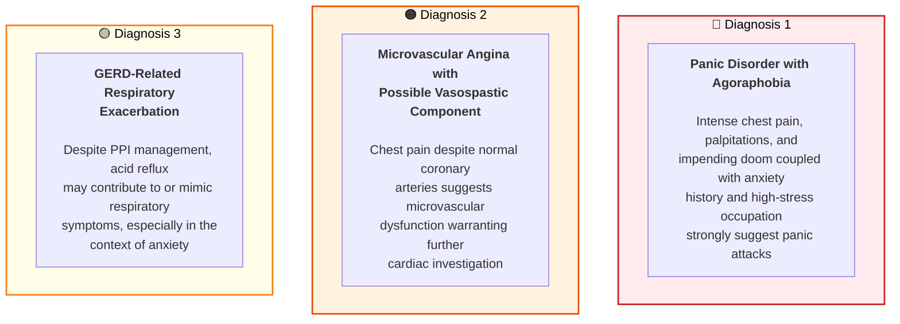
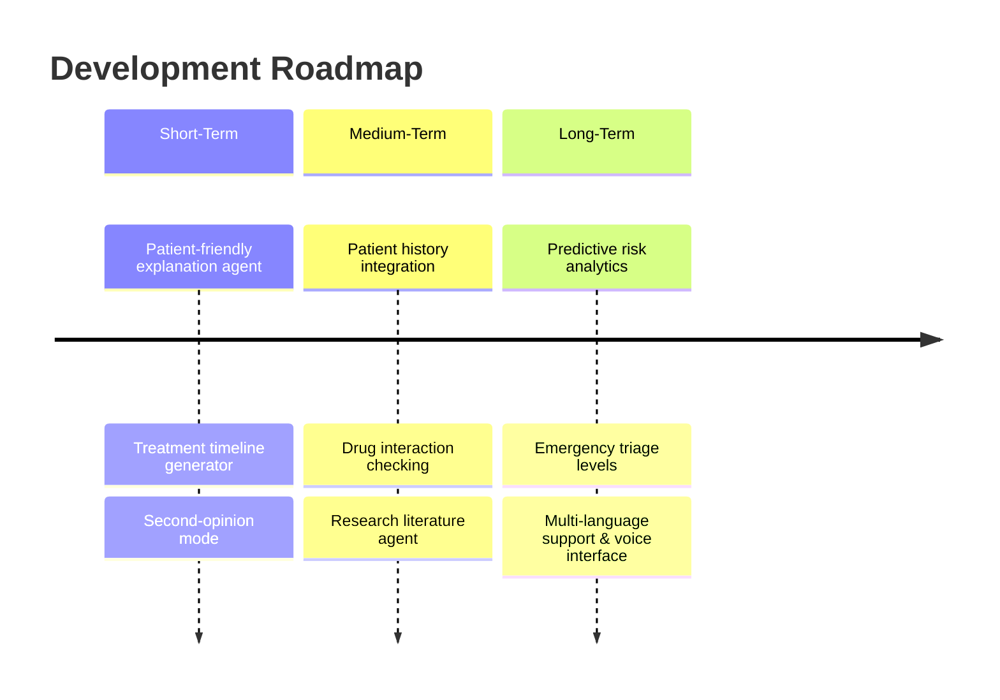
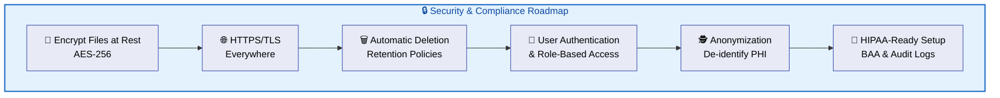

# 🏥 Multi-Agent Medical Report Analysis with Hallucination Control

An intelligent multi-agent AI system that analyzes medical reports using specialized LLM-powered agents (Cardiologist, Psychologist, Pulmonologist) running in parallel, synthesizes findings through a Multidisciplinary Team agent, and incorporates hallucination control mechanisms to ensure clinically grounded outputs.

> ⚠️ **Disclaimer:** This system is for educational and research purposes only and is not a substitute for professional medical advice, diagnosis, or treatment.

---

## 📌 Table of Contents

- [Overview](#overview)
- [System Architecture](#-system-architecture)
- [End-to-End Pipeline](#-end-to-end-pipeline)
- [Hallucination Control](#-hallucination-control)
- [Agent Interaction Flow](#-agent-interaction-flow)
- [Project Structure](#-project-structure)
- [Tech Stack](#-tech-stack)
- [Getting Started](#-getting-started)
- [Sample Output](#-sample-output)
- [Future Roadmap](#-future-roadmap)
- [Contributors](#-contributors)

---

## Overview

Medical reports are often long, unstructured, and manually reviewed — making the process time-consuming and error-prone. Single "black-box" AI systems can provide diagnoses but often lack transparent reasoning and may hallucinate medications, lab values, or patient history.

This project addresses these challenges by:

- Deploying **domain-specific specialist agents** that analyze reports from their area of expertise
- Running agents **concurrently** using Python's `ThreadPoolExecutor` for reduced latency
- Synthesizing specialist findings into a **unified multidisciplinary diagnosis**
- Applying a **5-layer hallucination defense strategy** to ensure output reliability
- Maintaining **human-in-the-loop** safety for clinical oversight

---

## 🏗 System Architecture



---

## 🔄 End-to-End Pipeline



---

## 🛡 Hallucination Control

The system implements a **5-layer defense strategy** to minimize AI hallucination:



### Hallucination Risk Score Formula



---

## 🤝 Agent Interaction Flow



---

## 📁 Project Structure

```
📦 multi-agent-medical-analysis
├── 🐍 Main.py                    # Orchestrator — runs agents concurrently & generates final diagnosis
├── 🤖 Agents.py                  # Agent classes (Cardiologist, Psychologist, Pulmonologist, MDT)
├── 📂 Medical Reports/
│   └── 📄 Medical Report - Michael Johnson - Panic Attack Disorder.txt
├── 📂 results/
│   └── 📄 final_diagnosis.txt    # Generated diagnosis output
├── 🔑 apikey.env                 # Google Gemini API key (not committed)
├── 📋 requirements.txt           # Python dependencies
├── 🚫 .gitignore
└── 📖 README.md
```

---

## 🛠 Tech Stack



| Category | Technology |
|----------|------------|
| **LLM** | Google Gemini 2.0 Flash |
| **Orchestration** | LangChain, LangChain-Google-GenAI |
| **Concurrency** | Python `concurrent.futures.ThreadPoolExecutor` |
| **Prompt Management** | LangChain `PromptTemplate` |
| **Backend** | Flask (for web interface variant) |
| **Report Generation** | ReportLab (PDF), JSON |
| **Environment Management** | python-dotenv |
| **Language** | Python 3.10+ |

---

## 🚀 Getting Started

### Prerequisites

- Python 3.10 or higher
- A Google Gemini API key ([Get one here](https://aistudio.google.com/apikey))

### Installation

1. **Clone the repository**

   ```bash
   git clone https://github.com/<your-username>/multi-agent-medical-analysis.git
   cd multi-agent-medical-analysis
   ```

2. **Create a virtual environment**

   ```bash
   python -m venv venv
   source venv/bin/activate        # macOS/Linux
   venv\Scripts\activate           # Windows
   ```

3. **Install dependencies**

   ```bash
   pip install -r requirements.txt
   ```

4. **Configure your API key**

   Create an `apikey.env` file in the project root:

   ```env
   GOOGLE_API_KEY = "your-google-gemini-api-key"
   ```

### Run the Analysis

```bash
python Main.py
```

The final diagnosis will be saved to `results/final_diagnosis.txt`.

---

## 📋 Sample Output

**Input:** Medical report for a 29-year-old male presenting with chest pain, palpitations, shortness of breath, dizziness, and sweating.

**Final Diagnosis (synthesized from 3 specialist agents):**



---

## 🗺 Future Roadmap



### 🔒 Production Readiness Considerations



## 📄 License

This project is licensed under the MIT License. See the [LICENSE](LICENSE) file for details.
